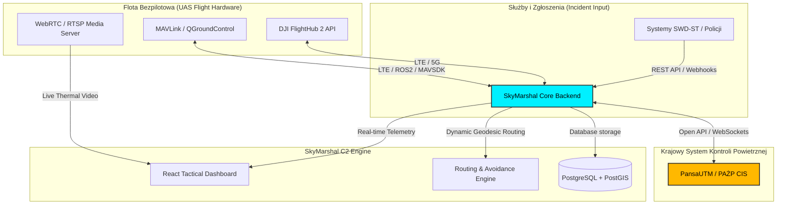

# 🌐 SkyMarshal C2 TAC-NET: Real-World Integration & Architecture

This document outlines how the **SkyMarshal** platform transitions from a highly functional hackathon prototype (MVP) into a production-ready, mission-critical Tactical Command & Control (C2) system deployed in Stalowa Wola, Poland.

---

## 🏗️ 1. Production Architecture Overview

In a real-world deployment, SkyMarshal acts as an **integrator layer** (Common Information Service - CIS) connecting field hardware, national airspace systems, and emergency dispatch services.

---

## 🔗 2. Key Integration Points with Existing Systems

To ensure maximum **Correctness (Poprawność)** and **Impact (Wpływ)** in the eyes of the jury, SkyMarshal is designed around four standard integration interfaces:

### A. National Airspace System: PAŻP PansaUTM
*   **How it works:** Under Polish and EU U-Space regulations, all commercial/state drone flights must register with the Polish Air Navigation Services Agency (PAŻP).
*   **Integration:** SkyMarshal acts as a **USP (U-Space Service Provider)**. It exchanges flight plans, requests geofenced clearances, and updates live telemetry via PAŻP's standard **Common Information Services (CIS) REST & WebSocket API**.
*   **Real-world Value:** Eliminates the manual process of operators calling flight towers or using consumer apps, automating airspace check-in.

### B. Hardware Integration: DJI FlightHub 2 & MAVLink
Connecting directly to individual radio controllers is unfeasible. Instead, SkyMarshal leverages enterprise cloud APIs:
1.  **DJI Enterprise Drones:** Integrates with **DJI FlightHub 2 Cloud API**. SkyMarshal pushes waypoints and controls via DJI API, which then relays them to industrial docks or controllers over LTE/5G.
2.  **Custom/Open-Source Drones (MAVLink):** For custom heavy-lift cargo drones, onboard companion computers (e.g., Raspberry Pi 5 / Jetson Orin Nano) running **MAVSDK** or **ROS2** communicate telemetry over secure VPN tunnels directly to SkyMarshal's **MQTT broker**.

### C. Emergency Services: SWD-ST / SWD-Policja
*   **How it works:** When a citizen reports a fire or accident, it enters the **System Wspomagania Dowodzenia (SWD)**.
*   **Integration:** SkyMarshal listens to SWD message queues (RabbitMQ/Kafka). Upon receiving a dispatch event with GPS coordinates:
    1.  The system automatically selects the nearest standby drone based on battery, speed, and sensor capabilities.
    2.  An optimized, legally-compliant trajectory is pre-calculated.
    3.  The human dispatcher only needs to click **"Approve & Launch"**.

### D. Geoportal & GIS Data Integration
*   **Integration:** Map layers in production use standard Open Geospatial Consortium (OGC) protocols like **WMS (Web Map Service)** and **WFS (Web Feature Service)**.
*   **Data Sources:** Integrates directly with **Geoportal.gov.pl** and municipal GIS systems to fetch:
    *   Precise digital terrain models (DTM) for obstacle and terrain-hugging flights.
    *   Real-time flood maps or critical infrastructure locations.

---

## ⚙️ 3. Production Technology Stack

To scale this MVP into a mission-critical municipal system, the recommended production stack is:

*   **Frontend:** React (Vite) + TailwindCSS + Leaflet/Mapbox GL JS (Web hardware acceleration).
*   **Backend:** Go (Golang) or Node.js (NestJS) – chosen for high concurrency, low latency, and robust WebSocket handling.
*   **Database:** **PostgreSQL with PostGIS extension** (enabling millisecond-level spatial indexing, polygon containment checks, and geofence intersections).
*   **Message Broker:** **Mosquitto (MQTT)** for lightweight, low-bandwidth drone telemetry streams; **RabbitMQ** for reliable enterprise event queuing.
*   **Streaming Server:** **Mediasoup / LiveKit (WebRTC)** to stream sub-100ms thermal and HD video feeds directly from drone payloads to the browser.

---

## 💡 4. Real-world Deployment Scenario: Stalowa Wola

1.  **Deployment:** Installed on local secure servers within the **Municipal Crisis Management Center (CZP)**.
2.  **Autonomous Docks:** Heavy drones (like the DJI Matrice 3D) are placed in autonomous weatherproof charging docks (e.g., DJI Dock 2) at key tactical points (HSW, I LO im. KEN, City Hall).
3.  **Operation:** Upon a critical alert (e.g., thermal alert at HSW), the system wakes the drone, opens the dock roof, uploads the *Geodesic Arc* routing, launches the mission completely autonomously, and streams live feeds to all integrated command posts.
