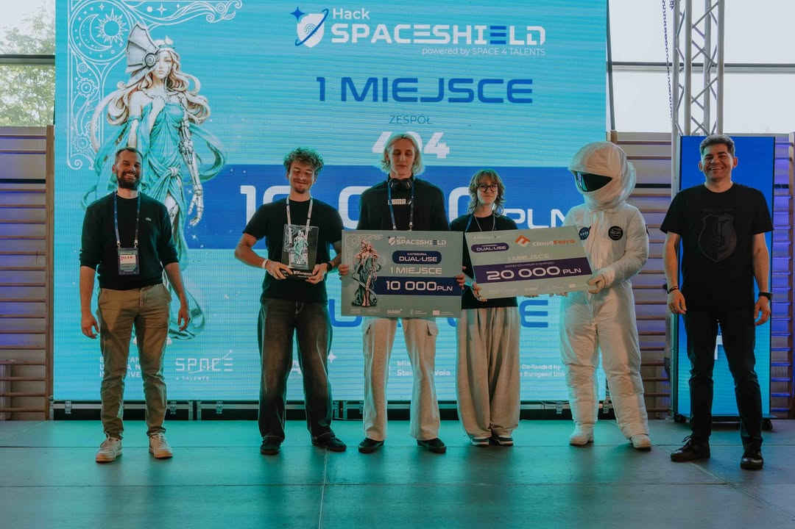

# 🌌 SkyMarshal C2 – System Zarządzania Flotą Dronów (Dual-Use)

**SkyMarshal C2** to aplikacja dyspozytorska stworzona na hackathon **SpaceShield Hack 2026** z myślą o koordynacji lotów bezzałogowych (UAV) na terenie Stalowej Woli. System pozwala na współpracę różnych służb miejskich i ratowniczych (Policja, Straż Pożarna, CZK) we wspólnej przestrzeni powietrznej.

🏆 **1. miejsce w kategorii Dual-Use na SpaceShield Hack 2026**  
Projekt został wyróżniony jako najlepsze rozwiązanie w swojej kategorii, łącząc praktyczny scenariusz operacyjny, integrację danych mapowych i prototyp procesu koordynacji lotów UAV.



*Uwaga: Jest to prototyp demonstracyjny pokazujący pomysł na integrację systemów. Nie jest połączony z prawdziwymi systemami państwowymi (PANSA/PAŻP, SWD-ST, MON) ani komercyjnymi bazami danych.*

---

## 🎥 Prezentacja Wideo (Demo)

Kliknij poniższy odtwarzacz, aby obejrzeć nagranie demonstracyjne w serwisie Vimeo:

[](https://vimeo.com/1195096071?share=copy&fl=sv&fe=ci)

---

## 🗺️ Co potrafi system?

### 1. Podkład mapowy z serwerów GUGiK (Geoportal)
*   Pobieranie na żywo ortofotomapy z rządowych serwerów WMS (**Geoportal.gov.pl**).
*   Możliwość szybkiego przełączania między ciemnym trybem taktycznym (czytelniejszym w nocy) a mapą satelitarną GUGiK dla dokładniejszego zwiadu w terenie.

### 2. Koordynacja wielu służb (Dual-use)
*   **Wspólne misje**: Szybkie uruchamianie akcji jednym kliknięciem (np. w przypadku zagrożenia na terenie Huty Stalowa Wola).
*   System automatycznie deleguje odpowiednie drony do jednego zdarzenia (np. dron Policji zabezpiecza teren z góry, a dron Straży Pożarnej prowadzi zwiad termowizyjny), przydzielając im różne wysokości lotu, aby uniknąć kolizji.

### 3. Inteligentne omijanie strefy HSW
*   **Router omijania stref (Bypass)**: Jeśli trasa lotu przebiega przez chroniony obszar Huty Stalowa Wola, algorytm automatycznie wyznacza trajektorię omijającą tę strefę (tworzy wielobok z bezpiecznym buforem 300 metrów). Dzięki temu dron omija strefę bez konieczności planowania okrężnej trasy na około całego miasta.

### 4. Zgodność z przepisami i integracja z UTM
*   **Weryfikacja wysokości**: Kreator misji blokuje planowanie lotów powyżej **120 metrów AGL** (zgodnie z unijnymi przepisami kategorii otwartej).
*   **Symulacja planów lotu (UTM)**: Prototyp symuluje proces zgłaszania lotu do PAŻP/DroneTower i przydziela fikcyjny kod transpondera (**XPNDR**).
*   **Monitoring zakłóceń**: Ostrzega pilota o wysokim poziomie zakłóceń elektromagnetycznych w pobliżu Elektrociepłowni Stalowa Wola (strefa R-05), pokazując wykres szumu w czasie rzeczywistym.

### 5. Wygodny Kreator Misji
*   Interfejs w układzie dwukolumnowym (side-by-side) – panel z formularzem znajduje się obok mapy, więc nic jej nie zasłania podczas planowania.
*   Wskazywanie celów misji bezpośrednio kliknięciem na mapie.

---

## 🛠️ Użyte technologie

*   **Frontend**: React 19, Vite
*   **Mapa**: React Leaflet / Leaflet.js
*   **Wykresy**: Recharts (wykres zakłóceń radiowych)
*   **Stylizacja**: Vanilla CSS + Tailwind CSS (ciemny interfejs taktyczny z efektem glassmorphism, płynne animacje)
*   **Dźwięki systemowe**: Web Audio API (dźwięki sonaru i alertów generowane są bezpośrednio przez przeglądarkę, bez wczytywania ciężkich plików audio)

---

## 📂 Struktura dokumentacji

W repozytorium znajdziesz:
*   [**`README.md`**](README.md) – Ten plik (opis i instrukcja uruchomienia).
*   [**`ARCHITECTURE.md`**](ARCHITECTURE.md) – Opis architektury technicznej, schematów integracji (DJI Cloud API, PansaUTM) i propozycji bazy danych.
*   [**`SOURCES.md`**](SOURCES.md) – Wykaz źródeł danych geograficznych i prawnych wykorzystanych w projekcie.

---

## 🚀 Jak uruchomić projekt lokalnie?

### Wymagania
Musisz mieć zainstalowany **Node.js** (wersja 18 lub nowsza) oraz **npm**.

### Instalacja i uruchomienie
1. Wejdź do folderu z projektem:
   ```bash
   cd skymarshal-app
   ```
2. Zainstaluj zależności:
   ```bash
   npm install
   ```
3. Uruchom serwer deweloperski:
   ```bash
   npm run dev
   ```
4. Otwórz w przeglądarce adres: [**http://localhost:5173/**](http://localhost:5173/)

### Budowanie wersji produkcyjnej
Jeśli chcesz zbudować zoptymalizowaną paczkę produkcyjną:
```bash
npm run build
```
Pliki zostaną zapisane w folderze `/dist`.

---

## 🇵🇱 Język interfejsu
Cały interfejs użytkownika, telemetria, opisy parametrów, komunikaty i alarmy są w 100% w języku polskim (atrybut `lang="pl"` w `index.html`).
